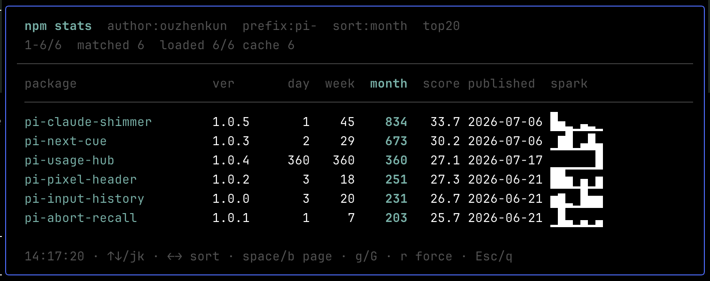

# pi-npm-stats

**npm package download/stats panel for pi — author search, top-N table, progressive load, and local cache.**

[](https://www.npmjs.com/package/pi-npm-stats)
[](https://opensource.org/licenses/MIT)

## Why

Checking npm downloads one package at a time breaks flow. pi-npm-stats pulls an author's packages into one TUI table — day/week/month downloads, version, publish date, and search score — with sort, scroll, and cache so you can glance at usage without leaving pi.

## Install

```bash
pi install npm:pi-npm-stats
```

Local development:

```bash
pi install ./pkgs/pi-npm-stats
```

## Commands

| Command | Description |
|---------|-------------|
| `/npm-stats` | Open panel with saved config |
| `/npm-stats <author>` | Query author (saved for next time) |
| `/npm-stats --prefix pi- --limit 20 --sort month` | Override filters |
| `/npm-stats --force` | Bypass download cache |

Author is required (config or CLI). Once author is present, prefs are written **before** the network request (`author` / `prefix` / `limit` / `sort`).



### Panel keys

| Key | Action |
|-----|--------|
| `↑/↓` or `k/j` | Scroll |
| `←/→` or `h/l` | Cycle sort column (left → right) |
| `s` | Next sort column |
| `space/f` · `b` | Page down / up |
| `g` / `G` | Top / bottom |
| `r` | Force refresh |
| `Esc` / `q` | Close |

Sort cycle: `name → ver → day → week → month → score → published`  
(`spark` is display-only.)

## Configuration

Create or auto-save `~/.pi/agent/pi-npm-stats.json`:

```json
{
  "author": "your-npm-username",
  "sort": "month",
  "limit": 20,
  "prefix": "",
  "cacheTtlHours": 6
}
```

| Field | Default | Description |
|-------|---------|-------------|
| `author` | `""` | npm `author:` search; required at runtime |
| `sort` | `month` | `name` / `ver` / `day` / `week` / `month` / `score` / `published` |
| `limit` | `20` | Top N after sort |
| `prefix` | `""` | Package name prefix filter |
| `cacheTtlHours` | `6` | Download cache TTL; `0` disables |

CLI args apply for the run and are written back when author is set (except `--force`). Panel `←/→` sort changes are in-session only (not written to config). Switching to `day`/`week`/`month` with incomplete download coverage triggers a soft reload.

Download cache file: `~/.pi/agent/pi-npm-stats-cache.json`.

## Columns

| Column | Source |
|--------|--------|
| ver | Latest version (npm search) |
| day / week / month | From one `downloads/range/last-month` request |
| score | npm `searchScore` (index/visibility, not downloads) |
| published | Latest publish date |
| spark | Last-7-day sparkline |

## Notes

- One download request per package; 429/5xx retry with backoff; concurrency 2.
- Metadata sorts (`name` / `ver` / `score` / `published`) only fetch downloads for top `limit`.
- Download sorts resolve all matched packages (cache or network), then keep top `limit`.

## License

MIT
